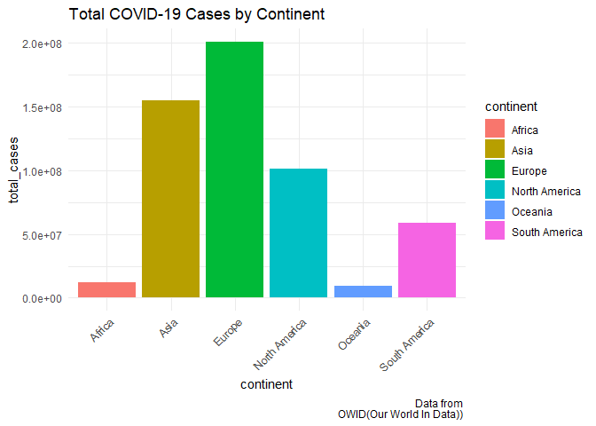
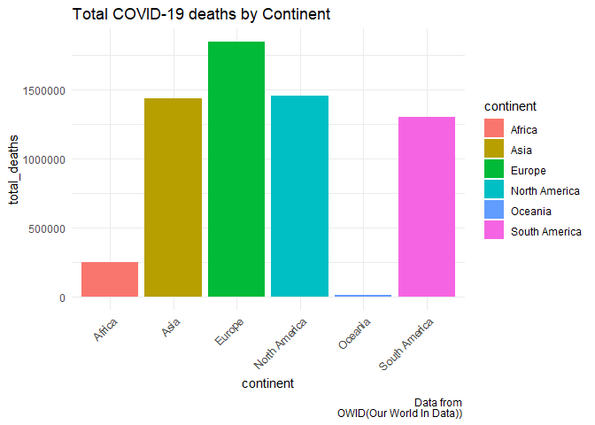

# Purpose

``` r
rm(list = ls()) # Clean your environment:
gc() # garbage collection - It can be useful to call gc after a large object has been removed, as this may prompt R to return memory to the operating system.
library(tidyverse)
list.files('code/', full.names = T, recursive = T) %>% .[grepl('.R', .)] %>% as.list() %>% walk(~source(.))
```

# Loading relevant packages

``` r
install.packages("pacman")
pacman::p_load(tidyverse)
pacman::p_load(readxl)
pacman::p_load(readr)
pacman::p_load(ggplot2)
library(tidyverse)
```

# Question 1

## Setting up file structure for Question 1

``` r
Texevier::create_template_html(directory = "C:/Users/austi/OneDrive/Desktop/Masters/Data Science/22582053",
                          template_name = "Question 1",
                          build_project = T, open_project = T)
```

``` r
library(tidyverse)
```

    ## ── Attaching core tidyverse packages ──────────────────────── tidyverse 2.0.0 ──
    ## ✔ dplyr     1.1.2     ✔ readr     2.1.4
    ## ✔ forcats   1.0.0     ✔ stringr   1.5.0
    ## ✔ ggplot2   3.4.2     ✔ tibble    3.2.1
    ## ✔ lubridate 1.9.2     ✔ tidyr     1.3.0
    ## ✔ purrr     1.0.1     
    ## ── Conflicts ────────────────────────────────────────── tidyverse_conflicts() ──
    ## ✖ dplyr::filter() masks stats::filter()
    ## ✖ dplyr::lag()    masks stats::lag()
    ## ℹ Use the conflicted package (<http://conflicted.r-lib.org/>) to force all conflicts to become errors

``` r
list.files('C:/Users/austi/OneDrive/Desktop/Masters/Data Science/22582053/Question 1/code', full.names = T, recursive = T) %>% as.list() %>% walk(~source(.))
```

# obtaining the total cases, total deaths on the last date:

``` r
Final_total_covid_cases <- obtain_total_covid_casses_function(owid_covid_data)
print(Final_total_covid_cases)
```

    ## # A tibble: 6 × 2
    ##   continent     total_cases
    ##   <chr>               <dbl>
    ## 1 Africa           11958596
    ## 2 Asia            155063285
    ## 3 Europe          201018817
    ## 4 North America   101452674
    ## 5 Oceania           9303433
    ## 6 South America    58555494

``` r
Final_total_covid_deaths <- obtain_total_deaths_function(owid_covid_data)
```

# Comparing the effect of Covid-19 on different continents

## Total cases

``` r
covid_continent_data <- continent_comparer_function(owid_covid_data, continent) #In this line of code I use a function that groups by continent and then provides a summary for the total cases, total deaths and total new cases. 

bar_plot_covid_data(Final_total_covid_cases)
```



## Total deaths

``` r
bar_plot_covid_deaths_data(Final_total_covid_deaths)
```



# Question 2

## Setting up the file structure for Question 2

``` r
Texevier::create_template_html(directory = "C:/Users/austi/OneDrive/Desktop/Masters/Data Science/22582053",
                          template_name = "Question 2",
                          build_project = T, open_project = T)
```

# QUestion 3

## Setting up the file structure for Question 3

``` r
Texevier::create_template(directory = "C:/Users/austi/OneDrive/Desktop/Masters/Data Science/22582053",
                          template_name = "Question 3",
                          build_project = T, open_project = T)
```

## Data

The data used is obtained from Spotify for the two bands of Coldplay and
Mettallica. The relevant excel files have been placed into the Question
3 data folder.

``` r
library(tidyverse)
list.files('C:/Users/austi/OneDrive/Desktop/Masters/Data Science/22582053/Question 3/code', full.names = T, recursive = T) %>% as.list() %>% walk(~source(.))
```

    ## 
    ## Attaching package: 'gridExtra'

    ## The following object is masked from 'package:dplyr':
    ## 
    ##     combine

``` r
#This code is used to call in the code used for Question 3. 
```

## Introduction

This comparison report will take a deep dive into the various attributes
of Coldplay and Mettallica, such as, tempo, loudness and valence. this
comparison report attempts to understand if their are certain attributes
that ensure a bands success. Throughout this report it is found that the
two bands are very different and that there are no certainties when it
comes to what attributes a band needs to become successful.

# Question 4

## Setting up the file structure for Question 4

``` r
Texevier::create_template(directory = "C:/Users/austi/OneDrive/Desktop/Masters/Data Science/22582053",
                          template_name = "Question 4",
                          build_project = T, open_project = T)
```

# Question 5

## Setting up the file structure for Question 5

``` r
Texevier::create_template_html(directory = "C:/Users/austi/OneDrive/Desktop/Masters/Data Science/22582053",
                          template_name = "Question 5",
                          build_project = T, open_project = T)
```
