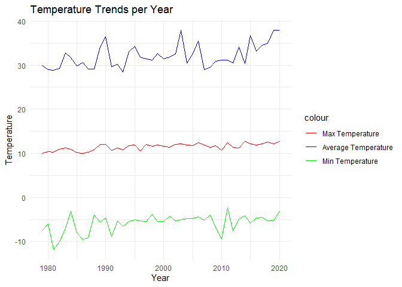
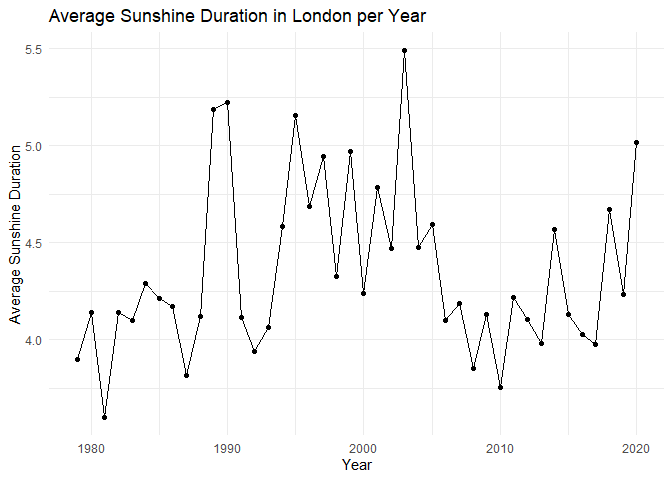
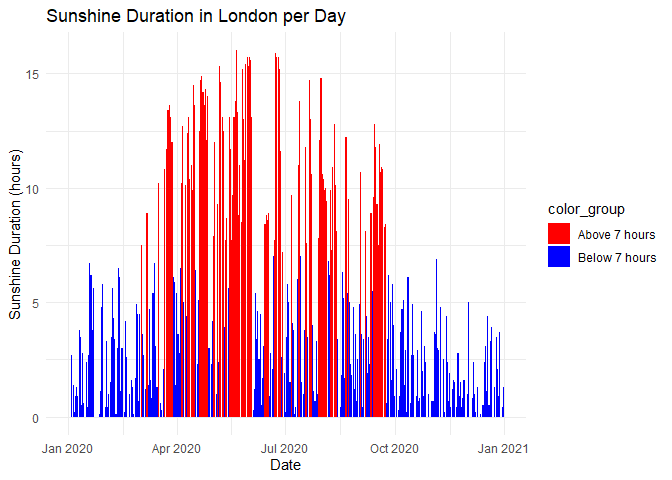
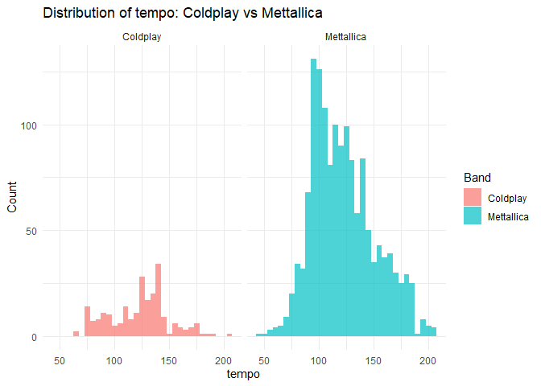
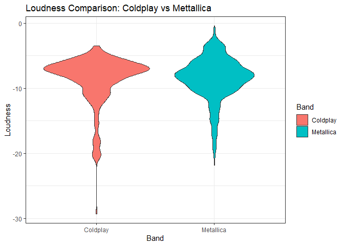
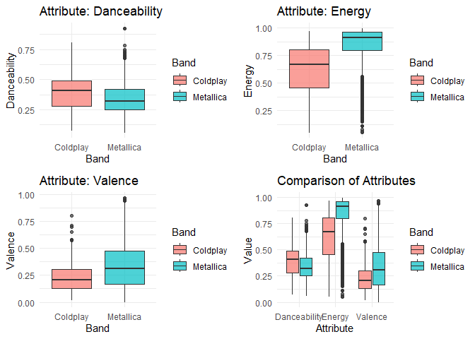
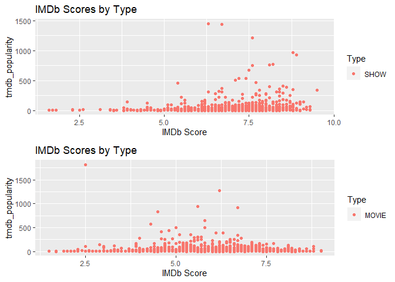
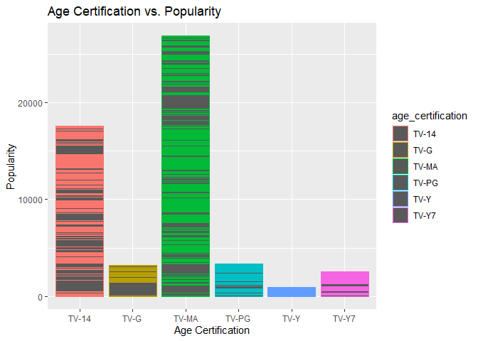
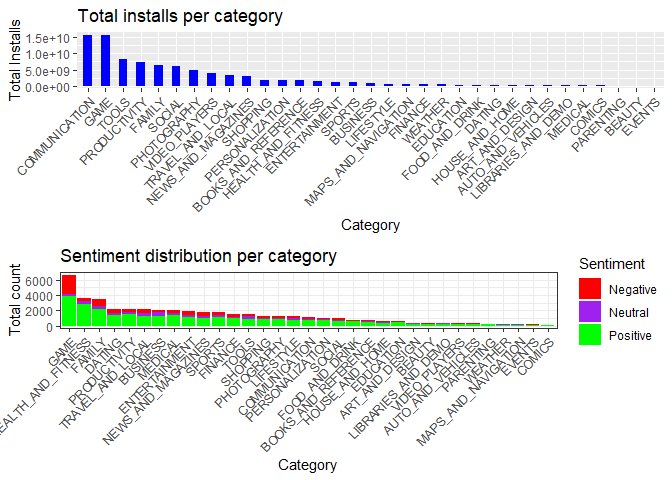

# Purpose

``` r
rm(list = ls()) # Clean your environment:
gc() # garbage collection - It can be useful to call gc after a large object has been removed, as this may prompt R to return memory to the operating system.
library(tidyverse)
list.files('code/', full.names = T, recursive = T) %>% .[grepl('.R', .)] %>% as.list() %>% walk(~source(.))
```

# Loading relevant packages

``` r
install.packages("pacman")
pacman::p_load(tidyverse)
pacman::p_load(readxl)
pacman::p_load(readr)
pacman::p_load(ggplot2)
pacman::p_load(gt)
library(gt)
library(tidyverse)
```

# Question 1

## Setting up file structure for Question 1

``` r
Texevier::create_template_html(directory = "C:/Users/austi/OneDrive/Desktop/Masters/Data Science/22582053",
                          template_name = "Question 1",
                          build_project = T, open_project = T)
```

``` r
library(tidyverse)
```

    ## ── Attaching core tidyverse packages ──────────────────────── tidyverse 2.0.0 ──
    ## ✔ dplyr     1.1.2     ✔ readr     2.1.4
    ## ✔ forcats   1.0.0     ✔ stringr   1.5.0
    ## ✔ ggplot2   3.4.2     ✔ tibble    3.2.1
    ## ✔ lubridate 1.9.2     ✔ tidyr     1.3.0
    ## ✔ purrr     1.0.1     
    ## ── Conflicts ────────────────────────────────────────── tidyverse_conflicts() ──
    ## ✖ dplyr::filter() masks stats::filter()
    ## ✖ dplyr::lag()    masks stats::lag()
    ## ℹ Use the conflicted package (<http://conflicted.r-lib.org/>) to force all conflicts to become errors

``` r
list.files('C:/Users/austi/OneDrive/Desktop/Masters/Data Science/22582053/Question 1/code', full.names = T, recursive = T) %>% as.list() %>% walk(~source(.))
```

# Introduction

Covid-19 caused havoc around the world. Covid-19 effected young and old
individuals as they feared for their life as well as their loved ones.
As total cases and deaths rose and months went on with no cure people
feared for the worst. Fortunately, governments have been able to contain
the various and lives are back to somewhat normal. This global pandemic
provides for some interesting stats to look into. In this analysis I
will provide insight into the total cases per continent and the total
deaths per continent which can provide for some interesting narratives.

# obtaining the total cases, total deaths on the last date:

``` r
#Using functions to obtain total cases and deaths 
Final_total_covid_cases <- obtain_total_covid_casses_function(owid_covid_data)
print(Final_total_covid_cases)
```

    ## # A tibble: 6 × 2
    ##   continent     total_cases
    ##   <chr>               <dbl>
    ## 1 Africa           11958596
    ## 2 Asia            155063285
    ## 3 Europe          201018817
    ## 4 North America   101452674
    ## 5 Oceania           9303433
    ## 6 South America    58555494

``` r
Final_total_covid_deaths <- obtain_total_deaths_function(owid_covid_data)
```

## Comparing the effect of Covid-19 on different continents

### Total cases

``` r
covid_continent_data <- continent_comparer_function(owid_covid_data, continent) #In this line of code I use a function that groups by continent and then provides a summary for the total cases, total deaths and total new cases. 

bar_plot_covid_data(Final_total_covid_cases)
```


As can be seen from the above figure Europe had a large majority of the
Covid-19 cases with Asia coming in second. An interesting insight to
discuss would be why did Europe have so many positive cases? Did they
fail to act quickly? Did they have a variant that was stronger than once
seen on other continents? Also interesting from the figure is that
Africa had a low share of the total cases. Therefore, another
interesting aspect to consider would be what did Africa do differently
to the likes of Asia and South Africa to have so few cases.

### Total deaths

``` r
#Creating a barplot for the total deaths per continent
bar_plot_covid_deaths_data(Final_total_covid_deaths)
```


When looking at the total deaths per continent we find some more
interesting data. One might expect the same distribution as the one
found in the first figure, More cases equals more deaths. However, this
is not the case. South and North America now account for a larger
proportion of the the deaths which means that they had a higher death
rate then that of Europe or Asia. Another fact to pick up on is that
Africa’s proportion has also increased meaning that Africa also had a
larger death rate. Some interesting aspects to look into would be why
did this happen? Why did some continents have high total cases but lower
death rates? Is it down to over all health? Do these continents pride
themselves on being health? Do they have better health care systems? Did
they get vaccines first? There are many interesting aspects that can be
followed up on after just looking into two simple plots.

## Conclusion

To conclude by just looking at these two simple plots, one can make some
interesting guesses. Does Africa have a poorer health care system then
the likes of Europe and Asia resulting in higher death rates. More
interestingly, why did North and South Africa get hit so hard?

# Question 2

## Setting up the file structure for Question 2

``` r
Texevier::create_template_html(directory = "C:/Users/austi/OneDrive/Desktop/Masters/Data Science/22582053",
                          template_name = "Question 2",
                          build_project = T, open_project = T)
```

This chunk of code is used to pull in all the functions that are placed
in the Question 2 code folder.

``` r
library(tidyverse)
list.files('C:/Users/austi/OneDrive/Desktop/Masters/Data Science/22582053/Question 2/code', full.names = T, recursive = T) %>% as.list() %>% walk(~source(.))

#This code is used to call in the code used for Question 2. 
```

## Data

## creating data frame with max, min and average

``` r
library(ggplot2)
library(dplyr)
library(lubridate)


london_max_mean_min <- london_weather_trends(london_weather)
```

## Plotting the max, min and average

``` r
temp_trend_plot(london_max_mean_min)
```



As can be seen in the above figure the min temerature gets to around
minus 10 degrees which i know you as a fair weather girl will not enjoy.
Furthermore the average temperature is only at a mere 10 degrees.

## Looking at the amount of sunshine london gets

### Creating a data frame with sunshine

``` r
london_sunshine <- calculate_avg_sunshine(london_weather)
```

### Ploting hours of sunshine per day on average

``` r
plot_avg_sunshine(london_sunshine)
```



As can be seen from the above figure there are many years that receive
less than 5 to 7 hpurs of sunchine a day on average. I know you wont
enjoy that. You may be saying that recently it has been getting better,
that is why I have made the next plot.

## Plotting London hours of sunshine per day for 2020

``` r
london_sunshine_last_year<- london_weather %>% 
    arrange(date) %>% 
    mutate(date = as.Date(as.character(date), format = "%Y%m%d")) %>% 
    filter(date>= lubridate::ymd("20200101")) 

plot_sunshine_per_day(london_sunshine_last_year)
```



From the above figure the red lines show days where there was sunshine
for over 7 overs and the blue lines show days throughout the year where
there was less than 7 hours of sunshine. As you can see there are way
too many days (which can be consecutive) where there is less than 7
hours of sun.

# Conclusion

PLease stay, there is not enough sun and the temp is way too cold for
you.

# QUestion 3

## Setting up the file structure for Question 3

``` r
Texevier::create_template(directory = "C:/Users/austi/OneDrive/Desktop/Masters/Data Science/22582053",
                          template_name = "Question 3",
                          build_project = T, open_project = T)
```

## Data

The data used is obtained from Spotify for the two bands of Coldplay and
Mettallica. The relevant excel files have been placed into the Question
3 data folder and then called from there into my enviroment.

``` r
#This code is too load my data into my enviroment
library(readr)
Coldplay <- read_csv("C:/Users/austi/OneDrive/Desktop/Masters/Data Science/22582053/Question 3/data/Coldplay.csv")
```

    ## Rows: 232 Columns: 15
    ## ── Column specification ────────────────────────────────────────────────────────
    ## Delimiter: ","
    ## chr   (2): name, album_name
    ## dbl  (11): duration, popularity, acousticness, danceability, energy, instrum...
    ## lgl   (1): explicit
    ## date  (1): release_date
    ## 
    ## ℹ Use `spec()` to retrieve the full column specification for this data.
    ## ℹ Specify the column types or set `show_col_types = FALSE` to quiet this message.

``` r
Metallica <- read_csv("C:/Users/austi/OneDrive/Desktop/Masters/Data Science/22582053/Question 3/data/metallica.csv")
```

    ## Rows: 1468 Columns: 14
    ## ── Column specification ────────────────────────────────────────────────────────
    ## Delimiter: ","
    ## chr   (2): name, album
    ## dbl  (11): duration_ms, popularity, danceability, energy, loudness, speechin...
    ## date  (1): release_date
    ## 
    ## ℹ Use `spec()` to retrieve the full column specification for this data.
    ## ℹ Specify the column types or set `show_col_types = FALSE` to quiet this message.

``` r
library(tidyverse)
list.files('C:/Users/austi/OneDrive/Desktop/Masters/Data Science/22582053/Question 3/code', full.names = T, recursive = T) %>% as.list() %>% walk(~source(.))
```

    ## 
    ## Attaching package: 'gridExtra'

    ## The following object is masked from 'package:dplyr':
    ## 
    ##     combine

``` r
#This code is used to call in the code used for Question 3. 
```

## Introduction

This comparison report will take a deep dive into the various attributes
of Coldplay and Mettallica, such as, tempo, loudness and valence. this
comparison report attempts to understand if their are certain attributes
that ensure a bands success. Throughout this report it is found that the
two bands are very different and that there are no certainties when it
comes to what attributes a band needs to become successful.

# Graphical representation of the data

## Histogram: Plotting histograms to Compare the distribution of tempo values for Coldplay and Metallica songs.

``` r
# This code uses a function to create a histogram comparing tempo values. 
tempo_distribution_function(Coldplay, Metallica, x_var = "tempo")
```



As can be seen in the above figure, Mettallica has on average a higher
tempo count then that of Coldplay. What this means is that Mettallica
tends to play songs that are of a faster pace than Coldplay. What can be
taken from this output is that having a fast or slow tempo on average
for a band will not hint towards the band not performing well over
generations. This is because the above figure is evidence towards two
successful bands with differing tempos.

## Violin Plot: Compare the distribution of loudness values for Coldplay and Metallica songs using a violin plot.

``` r
#This code uses a function to compare loudness values
data_loudness <- loudness_data_combined(Coldplay, Metallica, "Coldplay", "Metallica", "loudness")

loudness_comparison_plot(data_loudness, x_var = "Band", y_var = "Loudness")
```

    ## Warning: `aes_string()` was deprecated in ggplot2 3.0.0.
    ## ℹ Please use tidy evaluation idioms with `aes()`.
    ## ℹ See also `vignette("ggplot2-in-packages")` for more information.
    ## This warning is displayed once every 8 hours.
    ## Call `lifecycle::last_lifecycle_warnings()` to see where this warning was
    ## generated.



The purpose of the violin plot is too see the distribution of values. In
the case of the above figure we are analyzing the distribution of the
loudness variable for both Coldplay and Mettallica so as to compare how
loud the two bands on average play their music. As can be seen from the
above figure The mean values for both bands seem to be similar however,
the differences come in when we look at the tails. When evaluating the
tails of the above figure it is evident that Coldplay tends to the lower
volume while Mettallic on the occasion will play the louder music.

## Box Plot: Compare the distribution of multiple attributes (e.g., danceability, energy, valence) between Coldplay and Metallica songs using box plots side by side.

I tried to use functional coding for this section but then the code
wouldnt run properly as i couldnt get it perfect. I therefore settled
for the next best thing and went for the ugly looking code.

``` r
# Combining attribute data for both bands
attribute_data <- rbind(
  data.frame(Band = rep("Coldplay", nrow(Coldplay)), 
             Danceability = Coldplay$danceability,
             Energy = Coldplay$energy,
             Valence = Coldplay$valence),
  data.frame(Band = rep("Metallica", nrow(Metallica)), 
             Danceability = Metallica$danceability,
             Energy = Metallica$energy,
             Valence = Metallica$valence)
)

# Creating individual boxplots using a fucntion
danceability_boxplot <- attribute_boxplot_creator(attribute_data, "Danceability")

energy_boxplot <- attribute_boxplot_creator(attribute_data, "Energy")

valence_boxplot <-attribute_boxplot_creator(attribute_data, "Valence")

combined_boxplot <- combined_boxplot_creator(attribute_data)

grid.arrange(danceability_boxplot, energy_boxplot, valence_boxplot, combined_boxplot, ncol = 2)
```



The final plot we will be looking at are some combined box plots which
aims to explain the differences in the attributes of danceability,
energy, and valence. As can be seen by the above figure, Mettallica has
a lower danceability when compared to that of Coldplay, however, this is
the only measure where Mettallica lags Coldplay. On the other metrics
such as, energy and valence, Mettalic out performs Coldplay.

## Conclusion

Therefore, to conclude, when comparring the two generational bands of
Coldplay and Mettallica it is evident that the bands are very different.
Mettalica tend to play louder music with more energy, while Coldplay
likes to play music that is softer but easier to dance too resulting in
the attraction of different crowds. Thus from the output seen, there is
no one formula that will lead to a band being successful. A band can be
successful being themselves and playing music they enjoy.

# Question 4

## Setting up the file structure for Question 4

``` r
Texevier::create_template(directory = "C:/Users/austi/OneDrive/Desktop/Masters/Data Science/22582053",
                          template_name = "Question 4",
                          build_project = T, open_project = T)
```

## Data

The data is taken from Netflix.

``` r
#Reading in Netflic data
Netflix_data <- read_csv("C:/Users/austi/OneDrive/Desktop/Masters/Data Science/22582053/Question 4/data/titles.csv")
```

    ## Rows: 5806 Columns: 15
    ## ── Column specification ────────────────────────────────────────────────────────
    ## Delimiter: ","
    ## chr (8): id, title, type, description, age_certification, genres, production...
    ## dbl (7): release_year, runtime, seasons, imdb_score, imdb_votes, tmdb_popula...
    ## 
    ## ℹ Use `spec()` to retrieve the full column specification for this data.
    ## ℹ Specify the column types or set `show_col_types = FALSE` to quiet this message.

This is the code to read in the functions that are stored in the code
folder.

``` r
library(tidyverse)
list.files('C:/Users/austi/OneDrive/Desktop/Masters/Data Science/22582053/Question 4/code', full.names = T, recursive = T) %>% as.list() %>% walk(~source(.))

#This code is used to call in the code used for Question 4. 
```

## Introduction

In this analysis i will be looking at data from Netflix on what worked
well for Netflix and what did not. I will first be comparing movies and
TV shows so as to visualize which is best for overall performance of the
streaming service. Then i will be looking at whether different age
restricted shows and movies did better than others and if so which
performed the best.

## Plotting Show vs Movie

I want to evaluate whther shows are better for a streming service to
focus on or should they rather focus on movies.

``` r
#Using functions to plot a scatterplot
Netflix_show_data <- Netflix_data_summarised(Netflix_data, "SHOW")
```

    ## Warning: Returning more (or less) than 1 row per `summarise()` group was deprecated in
    ## dplyr 1.1.0.
    ## ℹ Please use `reframe()` instead.
    ## ℹ When switching from `summarise()` to `reframe()`, remember that `reframe()`
    ##   always returns an ungrouped data frame and adjust accordingly.
    ## Call `lifecycle::last_lifecycle_warnings()` to see where this warning was
    ## generated.

``` r
Netflix_movie_data <- Netflix_data_summarised(Netflix_data, "MOVIE")
```

    ## Warning: Returning more (or less) than 1 row per `summarise()` group was deprecated in
    ## dplyr 1.1.0.
    ## ℹ Please use `reframe()` instead.
    ## ℹ When switching from `summarise()` to `reframe()`, remember that `reframe()`
    ##   always returns an ungrouped data frame and adjust accordingly.
    ## Call `lifecycle::last_lifecycle_warnings()` to see where this warning was
    ## generated.

``` r
Netflix_combined_plot(Netflix_show_data, Netflix_movie_data)
```

    ## Warning: Removed 200 rows containing missing values (`geom_point()`).

    ## Warning: Removed 407 rows containing missing values (`geom_point()`).



    ## TableGrob (2 x 1) "arrange": 2 grobs
    ##   z     cells    name           grob
    ## 1 1 (1-1,1-1) arrange gtable[layout]
    ## 2 2 (2-2,1-1) arrange gtable[layout]

From the above scatter plot it is evident that shows outperform movies.
Shows have higher overall scores and ratings. To further ensure this
scatter plot provides the correct interpretation, i will next look at
the averages in a table.

## Table to compare Show and movie

I really did try to use functional coding here but it was not working so
i had to resort to the old ugly way of coding.

``` r
library(dplyr)
library(gt)

# Getting rid of NA's in the show data
show_data_filtered <- Netflix_show_data %>%
  filter(!is.na(imdb_score) & !is.na(tmdb_popularity) & !is.na(imdb_votes))

# Getting rid of NA's in the movie data
movie_data_filtered <- Netflix_movie_data %>%
  filter(!is.na(imdb_score) & !is.na(tmdb_popularity) & !is.na(imdb_votes))

# Calculating the average scores for the show data so that i can use these averages in the table
avg_show_score <- mean(show_data_filtered$imdb_score)
avg_show_popularity <- mean(show_data_filtered$tmdb_popularity)
avg_show_votes <- mean(show_data_filtered$imdb_votes)

# Calculating the average scores for the movie data
avg_movie_score <- mean(movie_data_filtered$imdb_score)
avg_movie_popularity <- mean(movie_data_filtered$tmdb_popularity)
avg_movie_votes <- mean(movie_data_filtered$imdb_votes)

# make a data frame with all the averages 
avg_Netflix <- tibble(
  Type = c("Show", "Movie"),
  Average_Score = c(avg_show_score, avg_movie_score),
  Average_Popularity = c(avg_show_popularity, avg_movie_popularity),
  Average_Votes = c(avg_show_votes, avg_movie_votes)
)

# Lets not make the table
table <- avg_Netflix %>%
  gt() %>%
  tab_header(title = "Averages for show and movie") %>%
  tab_style(
    style = cell_text(weight = "bold"),
    locations = cells_column_labels(columns = everything())
  ) %>%
  fmt_number(columns = c("Average_Score", "Average_Popularity", "Average_Votes"), decimals = 1) %>%
  cols_align(align = "center")


table
```

<div id="njefjmvsqc" style="padding-left:0px;padding-right:0px;padding-top:10px;padding-bottom:10px;overflow-x:auto;overflow-y:auto;width:auto;height:auto;">
<style>#njefjmvsqc table {
  font-family: system-ui, 'Segoe UI', Roboto, Helvetica, Arial, sans-serif, 'Apple Color Emoji', 'Segoe UI Emoji', 'Segoe UI Symbol', 'Noto Color Emoji';
  -webkit-font-smoothing: antialiased;
  -moz-osx-font-smoothing: grayscale;
}

#njefjmvsqc thead, #njefjmvsqc tbody, #njefjmvsqc tfoot, #njefjmvsqc tr, #njefjmvsqc td, #njefjmvsqc th {
  border-style: none;
}

#njefjmvsqc p {
  margin: 0;
  padding: 0;
}

#njefjmvsqc .gt_table {
  display: table;
  border-collapse: collapse;
  line-height: normal;
  margin-left: auto;
  margin-right: auto;
  color: #333333;
  font-size: 16px;
  font-weight: normal;
  font-style: normal;
  background-color: #FFFFFF;
  width: auto;
  border-top-style: solid;
  border-top-width: 2px;
  border-top-color: #A8A8A8;
  border-right-style: none;
  border-right-width: 2px;
  border-right-color: #D3D3D3;
  border-bottom-style: solid;
  border-bottom-width: 2px;
  border-bottom-color: #A8A8A8;
  border-left-style: none;
  border-left-width: 2px;
  border-left-color: #D3D3D3;
}

#njefjmvsqc .gt_caption {
  padding-top: 4px;
  padding-bottom: 4px;
}

#njefjmvsqc .gt_title {
  color: #333333;
  font-size: 125%;
  font-weight: initial;
  padding-top: 4px;
  padding-bottom: 4px;
  padding-left: 5px;
  padding-right: 5px;
  border-bottom-color: #FFFFFF;
  border-bottom-width: 0;
}

#njefjmvsqc .gt_subtitle {
  color: #333333;
  font-size: 85%;
  font-weight: initial;
  padding-top: 3px;
  padding-bottom: 5px;
  padding-left: 5px;
  padding-right: 5px;
  border-top-color: #FFFFFF;
  border-top-width: 0;
}

#njefjmvsqc .gt_heading {
  background-color: #FFFFFF;
  text-align: center;
  border-bottom-color: #FFFFFF;
  border-left-style: none;
  border-left-width: 1px;
  border-left-color: #D3D3D3;
  border-right-style: none;
  border-right-width: 1px;
  border-right-color: #D3D3D3;
}

#njefjmvsqc .gt_bottom_border {
  border-bottom-style: solid;
  border-bottom-width: 2px;
  border-bottom-color: #D3D3D3;
}

#njefjmvsqc .gt_col_headings {
  border-top-style: solid;
  border-top-width: 2px;
  border-top-color: #D3D3D3;
  border-bottom-style: solid;
  border-bottom-width: 2px;
  border-bottom-color: #D3D3D3;
  border-left-style: none;
  border-left-width: 1px;
  border-left-color: #D3D3D3;
  border-right-style: none;
  border-right-width: 1px;
  border-right-color: #D3D3D3;
}

#njefjmvsqc .gt_col_heading {
  color: #333333;
  background-color: #FFFFFF;
  font-size: 100%;
  font-weight: normal;
  text-transform: inherit;
  border-left-style: none;
  border-left-width: 1px;
  border-left-color: #D3D3D3;
  border-right-style: none;
  border-right-width: 1px;
  border-right-color: #D3D3D3;
  vertical-align: bottom;
  padding-top: 5px;
  padding-bottom: 6px;
  padding-left: 5px;
  padding-right: 5px;
  overflow-x: hidden;
}

#njefjmvsqc .gt_column_spanner_outer {
  color: #333333;
  background-color: #FFFFFF;
  font-size: 100%;
  font-weight: normal;
  text-transform: inherit;
  padding-top: 0;
  padding-bottom: 0;
  padding-left: 4px;
  padding-right: 4px;
}

#njefjmvsqc .gt_column_spanner_outer:first-child {
  padding-left: 0;
}

#njefjmvsqc .gt_column_spanner_outer:last-child {
  padding-right: 0;
}

#njefjmvsqc .gt_column_spanner {
  border-bottom-style: solid;
  border-bottom-width: 2px;
  border-bottom-color: #D3D3D3;
  vertical-align: bottom;
  padding-top: 5px;
  padding-bottom: 5px;
  overflow-x: hidden;
  display: inline-block;
  width: 100%;
}

#njefjmvsqc .gt_spanner_row {
  border-bottom-style: hidden;
}

#njefjmvsqc .gt_group_heading {
  padding-top: 8px;
  padding-bottom: 8px;
  padding-left: 5px;
  padding-right: 5px;
  color: #333333;
  background-color: #FFFFFF;
  font-size: 100%;
  font-weight: initial;
  text-transform: inherit;
  border-top-style: solid;
  border-top-width: 2px;
  border-top-color: #D3D3D3;
  border-bottom-style: solid;
  border-bottom-width: 2px;
  border-bottom-color: #D3D3D3;
  border-left-style: none;
  border-left-width: 1px;
  border-left-color: #D3D3D3;
  border-right-style: none;
  border-right-width: 1px;
  border-right-color: #D3D3D3;
  vertical-align: middle;
  text-align: left;
}

#njefjmvsqc .gt_empty_group_heading {
  padding: 0.5px;
  color: #333333;
  background-color: #FFFFFF;
  font-size: 100%;
  font-weight: initial;
  border-top-style: solid;
  border-top-width: 2px;
  border-top-color: #D3D3D3;
  border-bottom-style: solid;
  border-bottom-width: 2px;
  border-bottom-color: #D3D3D3;
  vertical-align: middle;
}

#njefjmvsqc .gt_from_md > :first-child {
  margin-top: 0;
}

#njefjmvsqc .gt_from_md > :last-child {
  margin-bottom: 0;
}

#njefjmvsqc .gt_row {
  padding-top: 8px;
  padding-bottom: 8px;
  padding-left: 5px;
  padding-right: 5px;
  margin: 10px;
  border-top-style: solid;
  border-top-width: 1px;
  border-top-color: #D3D3D3;
  border-left-style: none;
  border-left-width: 1px;
  border-left-color: #D3D3D3;
  border-right-style: none;
  border-right-width: 1px;
  border-right-color: #D3D3D3;
  vertical-align: middle;
  overflow-x: hidden;
}

#njefjmvsqc .gt_stub {
  color: #333333;
  background-color: #FFFFFF;
  font-size: 100%;
  font-weight: initial;
  text-transform: inherit;
  border-right-style: solid;
  border-right-width: 2px;
  border-right-color: #D3D3D3;
  padding-left: 5px;
  padding-right: 5px;
}

#njefjmvsqc .gt_stub_row_group {
  color: #333333;
  background-color: #FFFFFF;
  font-size: 100%;
  font-weight: initial;
  text-transform: inherit;
  border-right-style: solid;
  border-right-width: 2px;
  border-right-color: #D3D3D3;
  padding-left: 5px;
  padding-right: 5px;
  vertical-align: top;
}

#njefjmvsqc .gt_row_group_first td {
  border-top-width: 2px;
}

#njefjmvsqc .gt_row_group_first th {
  border-top-width: 2px;
}

#njefjmvsqc .gt_summary_row {
  color: #333333;
  background-color: #FFFFFF;
  text-transform: inherit;
  padding-top: 8px;
  padding-bottom: 8px;
  padding-left: 5px;
  padding-right: 5px;
}

#njefjmvsqc .gt_first_summary_row {
  border-top-style: solid;
  border-top-color: #D3D3D3;
}

#njefjmvsqc .gt_first_summary_row.thick {
  border-top-width: 2px;
}

#njefjmvsqc .gt_last_summary_row {
  padding-top: 8px;
  padding-bottom: 8px;
  padding-left: 5px;
  padding-right: 5px;
  border-bottom-style: solid;
  border-bottom-width: 2px;
  border-bottom-color: #D3D3D3;
}

#njefjmvsqc .gt_grand_summary_row {
  color: #333333;
  background-color: #FFFFFF;
  text-transform: inherit;
  padding-top: 8px;
  padding-bottom: 8px;
  padding-left: 5px;
  padding-right: 5px;
}

#njefjmvsqc .gt_first_grand_summary_row {
  padding-top: 8px;
  padding-bottom: 8px;
  padding-left: 5px;
  padding-right: 5px;
  border-top-style: double;
  border-top-width: 6px;
  border-top-color: #D3D3D3;
}

#njefjmvsqc .gt_last_grand_summary_row_top {
  padding-top: 8px;
  padding-bottom: 8px;
  padding-left: 5px;
  padding-right: 5px;
  border-bottom-style: double;
  border-bottom-width: 6px;
  border-bottom-color: #D3D3D3;
}

#njefjmvsqc .gt_striped {
  background-color: rgba(128, 128, 128, 0.05);
}

#njefjmvsqc .gt_table_body {
  border-top-style: solid;
  border-top-width: 2px;
  border-top-color: #D3D3D3;
  border-bottom-style: solid;
  border-bottom-width: 2px;
  border-bottom-color: #D3D3D3;
}

#njefjmvsqc .gt_footnotes {
  color: #333333;
  background-color: #FFFFFF;
  border-bottom-style: none;
  border-bottom-width: 2px;
  border-bottom-color: #D3D3D3;
  border-left-style: none;
  border-left-width: 2px;
  border-left-color: #D3D3D3;
  border-right-style: none;
  border-right-width: 2px;
  border-right-color: #D3D3D3;
}

#njefjmvsqc .gt_footnote {
  margin: 0px;
  font-size: 90%;
  padding-top: 4px;
  padding-bottom: 4px;
  padding-left: 5px;
  padding-right: 5px;
}

#njefjmvsqc .gt_sourcenotes {
  color: #333333;
  background-color: #FFFFFF;
  border-bottom-style: none;
  border-bottom-width: 2px;
  border-bottom-color: #D3D3D3;
  border-left-style: none;
  border-left-width: 2px;
  border-left-color: #D3D3D3;
  border-right-style: none;
  border-right-width: 2px;
  border-right-color: #D3D3D3;
}

#njefjmvsqc .gt_sourcenote {
  font-size: 90%;
  padding-top: 4px;
  padding-bottom: 4px;
  padding-left: 5px;
  padding-right: 5px;
}

#njefjmvsqc .gt_left {
  text-align: left;
}

#njefjmvsqc .gt_center {
  text-align: center;
}

#njefjmvsqc .gt_right {
  text-align: right;
  font-variant-numeric: tabular-nums;
}

#njefjmvsqc .gt_font_normal {
  font-weight: normal;
}

#njefjmvsqc .gt_font_bold {
  font-weight: bold;
}

#njefjmvsqc .gt_font_italic {
  font-style: italic;
}

#njefjmvsqc .gt_super {
  font-size: 65%;
}

#njefjmvsqc .gt_footnote_marks {
  font-size: 75%;
  vertical-align: 0.4em;
  position: initial;
}

#njefjmvsqc .gt_asterisk {
  font-size: 100%;
  vertical-align: 0;
}

#njefjmvsqc .gt_indent_1 {
  text-indent: 5px;
}

#njefjmvsqc .gt_indent_2 {
  text-indent: 10px;
}

#njefjmvsqc .gt_indent_3 {
  text-indent: 15px;
}

#njefjmvsqc .gt_indent_4 {
  text-indent: 20px;
}

#njefjmvsqc .gt_indent_5 {
  text-indent: 25px;
}
</style>
<table class="gt_table" data-quarto-disable-processing="false" data-quarto-bootstrap="false">
  <thead>
    <tr class="gt_heading">
      <td colspan="4" class="gt_heading gt_title gt_font_normal gt_bottom_border" style>Averages for show and movie</td>
    </tr>
    
    <tr class="gt_col_headings">
      <th class="gt_col_heading gt_columns_bottom_border gt_center" rowspan="1" colspan="1" style="font-weight: bold;" scope="col" id="Type">Type</th>
      <th class="gt_col_heading gt_columns_bottom_border gt_center" rowspan="1" colspan="1" style="font-weight: bold;" scope="col" id="Average_Score">Average_Score</th>
      <th class="gt_col_heading gt_columns_bottom_border gt_center" rowspan="1" colspan="1" style="font-weight: bold;" scope="col" id="Average_Popularity">Average_Popularity</th>
      <th class="gt_col_heading gt_columns_bottom_border gt_center" rowspan="1" colspan="1" style="font-weight: bold;" scope="col" id="Average_Votes">Average_Votes</th>
    </tr>
  </thead>
  <tbody class="gt_table_body">
    <tr><td headers="Type" class="gt_row gt_center">Show</td>
<td headers="Average_Score" class="gt_row gt_center">7.0</td>
<td headers="Average_Popularity" class="gt_row gt_center">30.6</td>
<td headers="Average_Votes" class="gt_row gt_center">17,745.0</td></tr>
    <tr><td headers="Type" class="gt_row gt_center">Movie</td>
<td headers="Average_Score" class="gt_row gt_center">6.3</td>
<td headers="Average_Popularity" class="gt_row gt_center">19.8</td>
<td headers="Average_Votes" class="gt_row gt_center">27,097.4</td></tr>
  </tbody>
  
  
</table>
</div>

From the above table it is evident that the suspension made by the first
scatterplot are correct. Shows do outperform movies. Shows have a much
higher popularity and a higher score. Thus it seems to be that it would
be more beneficial for a streaming service to focus on TV shows over
movies. Next I will be looking at which age restricted shows and movies
are the most popular and highest rated.

## Age certification plot

``` r
library(ggplot2)

# Plotting the age certification plot
plot_age_certification(Netflix_data)
```



From the above figure, it is evident that if a streaming service wnats
to put themselves in the best position to succeed, they should look at
focusing on tv shows with a few movies with the age certification of
TV_MA or TV-14.

# Conclusion

After a short but thurough analysis it is suggested that if a streaing
service wants to learn from Netflex they should look at focusing on tv
shows with a few movies with the age certification of TV_MA or TV-14.

# Question 5

## Setting up the file structure for Question 5

``` r
Texevier::create_template_html(directory = "C:/Users/austi/OneDrive/Desktop/Masters/Data Science/22582053",
                          template_name = "Question 5",
                          build_project = T, open_project = T)
```

## Data

The data used is placed into the Question 5 code folder and is based on
information from a database of app downloads from Google

### Loading data

``` r
library(readr)
google_playstore <- read_csv("C:/Users/austi/OneDrive/Desktop/Masters/Data Science/22582053/Question 5/data/googleplaystore.csv")
```

    ## Rows: 10054 Columns: 13
    ## ── Column specification ────────────────────────────────────────────────────────
    ## Delimiter: ","
    ## chr (11): App, Category, Size, Installs, Type, Price, Content Rating, Genres...
    ## dbl  (2): Rating, Reviews
    ## 
    ## ℹ Use `spec()` to retrieve the full column specification for this data.
    ## ℹ Specify the column types or set `show_col_types = FALSE` to quiet this message.

``` r
googleplaystore_user_reviews <- read_csv("C:/Users/austi/OneDrive/Desktop/Masters/Data Science/22582053/Question 5/data/googleplaystore_user_reviews.csv")
```

    ## Rows: 64295 Columns: 5
    ## ── Column specification ────────────────────────────────────────────────────────
    ## Delimiter: ","
    ## chr (3): App, Translated_Review, Sentiment
    ## dbl (2): Sentiment_Polarity, Sentiment_Subjectivity
    ## 
    ## ℹ Use `spec()` to retrieve the full column specification for this data.
    ## ℹ Specify the column types or set `show_col_types = FALSE` to quiet this message.

``` r
library(tidyverse)
list.files('C:/Users/austi/OneDrive/Desktop/Masters/Data Science/22582053/Question 5/code', full.names = T, recursive = T) %>% as.list() %>% walk(~source(.))

#This code is used to call in the code used for Question 5. 
```

## Introduction

In this analysis I look at the total installs per category of app, the
sentiment of each category and whether there is a difference in rating
and sentiment for paid a free apps.

## Cleaning the data

I tried to use functional coding but I was not getting the desired
output, So I therefore resulted to the ugly way of coding.

### Creating a date column

``` r
library(dplyr)
library(lubridate)
#Creating a date column to i could observe the data over time if needed. 
google_playstore$`Last Updated` <- mdy(google_playstore$`Last Updated`)
```

### Joining the two data sets

``` r
# Joining the two datasets together
app_merged_data <- left_join(google_playstore,googleplaystore_user_reviews, by = "App")
```

    ## Warning in left_join(google_playstore, googleplaystore_user_reviews, by = "App"): Detected an unexpected many-to-many relationship between `x` and `y`.
    ## ℹ Row 8 of `x` matches multiple rows in `y`.
    ## ℹ Row 17208 of `y` matches multiple rows in `x`.
    ## ℹ If a many-to-many relationship is expected, set `relationship =
    ##   "many-to-many"` to silence this warning.

## Creating the total installs plot

``` r
# Creating total installs plot 
installs_bar_plot <- total_installs_bar_plot(google_playstore)

# Creating plot of sentiment
plot_sentiment <- sentiment_bar_plot(app_merged_data)

# joining the two plots together
Plots_combined <- plots_combining_function(installs_bar_plot, plot_sentiment)
```



``` r
# Display the combined plot
print(Plots_combined)
```

    ## function (bar_plot, sentiment_plot) 
    ## {
    ##     combined_plot <- gridExtra::grid.arrange(bar_plot, sentiment_plot, 
    ##         nrow = 2)
    ##     return(plots_combining_function)
    ## }

From the above plot it is evident that communication and gamming apps
dominate the total installs. Although there will be a decent amount of
competition there is a lot of growth opportunity for a pp that focuses
on communication/gaming, possibly a market for joining the two
categories.

# Table for average rating free vs paid apps

Note: I am really not sure why this code is running perfectly but not
knitting. I feel liike i have tried everything. Please find the output
of the table in my Question 5 folder where it runs perfectly.

``` r
# Using functions to get the average rating and sentiment polarity for free and paid apps
# Using functions to get the average rating and sentiment polarity for free and paid apps
#free_app_rating <- rating_average_calculator(app_merged_data, "Free")
#paid_app_rating <- rating_average_calculator(app_merged_data, "Paid")
#free_app_sentiment_polarity <- sentiment_polarity_calculator(app_merged_data, "Free")
#paid_app_sentiment_polarity <- sentiment_polarity_calculator(app_merged_data, "Paid")

#table_app_rating_sentiment_average <- table_rating_polarity_average(app_merged_data, free_app_rating, paid_app_rating, free_app_sentiment_polarity, paid_app_sentiment_polarity)

#table_app_rating_sentiment_average
```

From the above table it is seen that gaming apps have the highest
positive sentiment, however, these specific apps tend to have a decent
amount of negative sentiment to them. This my hint towards better
opportunity for communication apps as they are not as heavily dominated
by negative sentiment.

# Conclusion

Look into creating an app that focuses on communication due to the high
installs ( This means there is a demand for these types of apps ). I
would suggest communication over gaming as you are targeting a larger
market and are less likely to be dominated by negative sentiment.
