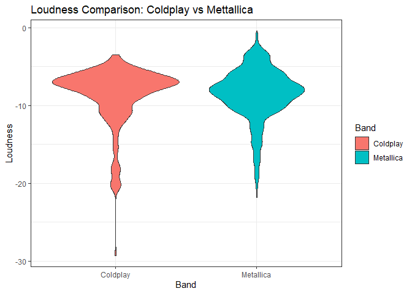

# Purpose

``` r
rm(list = ls()) # Clean your environment:
gc() # garbage collection - It can be useful to call gc after a large object has been removed, as this may prompt R to return memory to the operating system.
library(tidyverse)
list.files('code/', full.names = T, recursive = T) %>% .[grepl('.R', .)] %>% as.list() %>% walk(~source(.))
```

# Loading relevant packages

``` r
install.packages("pacman")
pacman::p_load(tidyverse)
pacman::p_load(readxl)
pacman::p_load(readr)
pacman::p_load(ggplot2)
library(tidyverse)
```

# Question 1

## Setting up file structure for Question 1

``` r
Texevier::create_template_html(directory = "C:/Users/austi/OneDrive/Desktop/Masters/Data Science/22582053",
                          template_name = "Question 1",
                          build_project = T, open_project = T)
```

``` r
library(tidyverse)
```

    ## ── Attaching core tidyverse packages ──────────────────────── tidyverse 2.0.0 ──
    ## ✔ dplyr     1.1.2     ✔ readr     2.1.4
    ## ✔ forcats   1.0.0     ✔ stringr   1.5.0
    ## ✔ ggplot2   3.4.2     ✔ tibble    3.2.1
    ## ✔ lubridate 1.9.2     ✔ tidyr     1.3.0
    ## ✔ purrr     1.0.1     
    ## ── Conflicts ────────────────────────────────────────── tidyverse_conflicts() ──
    ## ✖ dplyr::filter() masks stats::filter()
    ## ✖ dplyr::lag()    masks stats::lag()
    ## ℹ Use the conflicted package (<http://conflicted.r-lib.org/>) to force all conflicts to become errors

``` r
list.files('C:/Users/austi/OneDrive/Desktop/Masters/Data Science/22582053/Question 1/code', full.names = T, recursive = T) %>% as.list() %>% walk(~source(.))
```

# obtaining the total cases, total deaths on the last date:

``` r
Final_total_covid_cases <- obtain_total_covid_casses_function(owid_covid_data)
print(Final_total_covid_cases)
```

    ## # A tibble: 6 × 2
    ##   continent     total_cases
    ##   <chr>               <dbl>
    ## 1 Africa           11958596
    ## 2 Asia            155063285
    ## 3 Europe          201018817
    ## 4 North America   101452674
    ## 5 Oceania           9303433
    ## 6 South America    58555494

``` r
Final_total_covid_deaths <- obtain_total_deaths_function(owid_covid_data)
```

# Comparing the effect of Covid-19 on different continents

## Total cases

``` r
covid_continent_data <- continent_comparer_function(owid_covid_data, continent) #In this line of code I use a function that groups by continent and then provides a summary for the total cases, total deaths and total new cases. 

bar_plot_covid_data(Final_total_covid_cases)
```


## Total deaths

``` r
bar_plot_covid_deaths_data(Final_total_covid_deaths)
```


# Question 2

## Setting up the file structure for Question 2

``` r
Texevier::create_template_html(directory = "C:/Users/austi/OneDrive/Desktop/Masters/Data Science/22582053",
                          template_name = "Question 2",
                          build_project = T, open_project = T)
```

# QUestion 3

## Setting up the file structure for Question 3

``` r
Texevier::create_template(directory = "C:/Users/austi/OneDrive/Desktop/Masters/Data Science/22582053",
                          template_name = "Question 3",
                          build_project = T, open_project = T)
```

## Data

The data used is obtained from Spotify for the two bands of Coldplay and
Mettallica. The relevant excel files have been placed into the Question
3 data folder and then called from there into my enviroment.

``` r
#This code is too load my data into my enviroment
library(readr)
Coldplay <- read_csv("C:/Users/austi/OneDrive/Desktop/Masters/Data Science/22582053/Question 3/data/Coldplay.csv")
```

    ## Rows: 232 Columns: 15
    ## ── Column specification ────────────────────────────────────────────────────────
    ## Delimiter: ","
    ## chr   (2): name, album_name
    ## dbl  (11): duration, popularity, acousticness, danceability, energy, instrum...
    ## lgl   (1): explicit
    ## date  (1): release_date
    ## 
    ## ℹ Use `spec()` to retrieve the full column specification for this data.
    ## ℹ Specify the column types or set `show_col_types = FALSE` to quiet this message.

``` r
Metallica <- read_csv("C:/Users/austi/OneDrive/Desktop/Masters/Data Science/22582053/Question 3/data/metallica.csv")
```

    ## Rows: 1468 Columns: 14
    ## ── Column specification ────────────────────────────────────────────────────────
    ## Delimiter: ","
    ## chr   (2): name, album
    ## dbl  (11): duration_ms, popularity, danceability, energy, loudness, speechin...
    ## date  (1): release_date
    ## 
    ## ℹ Use `spec()` to retrieve the full column specification for this data.
    ## ℹ Specify the column types or set `show_col_types = FALSE` to quiet this message.

``` r
library(tidyverse)
list.files('C:/Users/austi/OneDrive/Desktop/Masters/Data Science/22582053/Question 3/code', full.names = T, recursive = T) %>% as.list() %>% walk(~source(.))
```

    ## 
    ## Attaching package: 'gridExtra'

    ## The following object is masked from 'package:dplyr':
    ## 
    ##     combine

``` r
#This code is used to call in the code used for Question 3. 
```

## Introduction

This comparison report will take a deep dive into the various attributes
of Coldplay and Mettallica, such as, tempo, loudness and valence. this
comparison report attempts to understand if their are certain attributes
that ensure a bands success. Throughout this report it is found that the
two bands are very different and that there are no certainties when it
comes to what attributes a band needs to become successful.

# Graphical representation of the data

## Histogram: Plotting histograms to Compare the distribution of tempo values for Coldplay and Metallica songs.

``` r
# This code uses a function to create a histogram comparing tempo values. 
tempo_distribution_function(Coldplay, Metallica, x_var = "tempo")
```


As can be seen in the above figure, Mettallica has on average a higher
tempo count then that of Coldplay. What this means is that Mettallica
tends to play songs that are of a faster pace than Coldplay. What can be
taken from this output is that having a fast or slow tempo on average
for a band will not hint towards the band not performing well over
generations. This is because the above figure is evidence towards two
successful bands with differing tempos.

## Violin Plot: Compare the distribution of loudness values for Coldplay and Metallica songs using a violin plot.

``` r
#This code uses a function to compare loudness values
data_loudness <- loudness_data_combined(Coldplay, Metallica, "Coldplay", "Metallica", "loudness")

loudness_comparison_plot(data_loudness, x_var = "Band", y_var = "Loudness")
```

    ## Warning: `aes_string()` was deprecated in ggplot2 3.0.0.
    ## ℹ Please use tidy evaluation idioms with `aes()`.
    ## ℹ See also `vignette("ggplot2-in-packages")` for more information.
    ## This warning is displayed once every 8 hours.
    ## Call `lifecycle::last_lifecycle_warnings()` to see where this warning was
    ## generated.



The purpose of the violin plot is too see the distribution of values. In
the case of the above figure we are analyzing the distribution of the
loudness variable for both Coldplay and Mettallica so as to compare how
loud the two bands on average play their music. As can be seen from the
above figure The mean values for both bands seem to be similar however,
the differences come in when we look at the tails. When evaluating the
tails of the above figure it is evident that Coldplay tends to the lower
volume while Mettallic on the occasion will play the louder music.

## Box Plot: Compare the distribution of multiple attributes (e.g., danceability, energy, valence) between Coldplay and Metallica songs using box plots side by side.

I tried to use functional coding for this section but then the code
wouldnt run properly as i couldnt get it perfect. I therefore settled
for the next best thing and went for the ugly looking code.

``` r
# Combining attribute data for both bands
attribute_data <- rbind(
  data.frame(Band = rep("Coldplay", nrow(Coldplay)), 
             Danceability = Coldplay$danceability,
             Energy = Coldplay$energy,
             Valence = Coldplay$valence),
  data.frame(Band = rep("Metallica", nrow(Metallica)), 
             Danceability = Metallica$danceability,
             Energy = Metallica$energy,
             Valence = Metallica$valence)
)

# Creating individual boxplots using a fucntion
danceability_boxplot <- attribute_boxplot_creator(attribute_data, "Danceability")

energy_boxplot <- attribute_boxplot_creator(attribute_data, "Energy")

valence_boxplot <-attribute_boxplot_creator(attribute_data, "Valence")

combined_boxplot <- combined_boxplot_creator(attribute_data)

grid.arrange(danceability_boxplot, energy_boxplot, valence_boxplot, combined_boxplot, ncol = 2)
```


The final plot we will be looking at are some combined box plots which
aims to explain the differences in the attributes of danceability,
energy, and valence. As can be seen by the above figure, Mettallica has
a lower danceability when compared to that of Coldplay, however, this is
the only measure where Mettallica lags Coldplay. On the other metrics
such as, energy and valence, Mettalic out performs Coldplay.

## Conclusion

Therefore, to conclude, when comparring the two generational bands of
Coldplay and Mettallica it is evident that the bands are very different.
Mettalica tend to play louder music with more energy, while Coldplay
likes to play music that is softer but easier to dance too resulting in
the attraction of different crowds. Thus from the output seen, there is
no one formula that will lead to a band being successful. A band can be
successful being themselves and playing music they enjoy.

# Question 4

## Setting up the file structure for Question 4

``` r
Texevier::create_template(directory = "C:/Users/austi/OneDrive/Desktop/Masters/Data Science/22582053",
                          template_name = "Question 4",
                          build_project = T, open_project = T)
```

# Question 5

## Setting up the file structure for Question 5

``` r
Texevier::create_template_html(directory = "C:/Users/austi/OneDrive/Desktop/Masters/Data Science/22582053",
                          template_name = "Question 5",
                          build_project = T, open_project = T)
```
